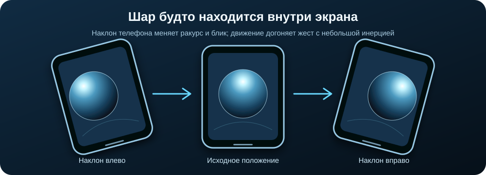
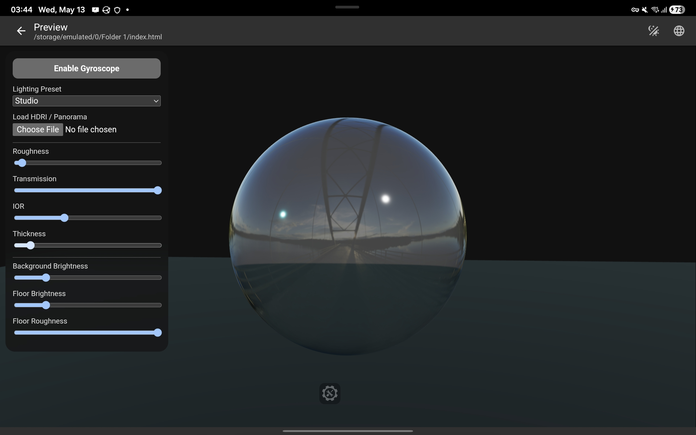

# Стеклянный шар с управлением гироскопом

Интерактивная 3D-сцена в одном HTML-файле. Стеклянный шар, освещение и окружение собраны на Three.js; на телефоне положение камеры можно связать с поворотом устройства.

**[Открыть демо](https://linnkoln.github.io/glass-sphere-gyroscope/)**

## Идея

Шар задуман как псевдофизический элемент интерфейса: при изменении положения телефона он меняет ракурс так, будто находится внутри экрана. Поворот датчика передаётся виртуальной камере, а движение сглаживается, чтобы шар немного «догонял» жест. Это демонстрация взаимодействия, а не полноценная физическая симуляция.



В верхней части панели есть маленький пример такого элемента. На телефоне он реагирует на наклон после включения гироскопа. На компьютере проведите по нему курсором, чтобы увидеть тот же принцип без датчика.

На узком экране дополнительные настройки свёрнуты под кнопкой **Scene settings**, чтобы шар оставался видимым.



## Что можно попробовать

- Нажать **Enable Gyroscope** на телефоне и повернуть устройство. На iOS браузер может отдельно запросить доступ к датчику.
- Сравнить реакцию большого 3D-шара и маленького элемента интерфейса. Оба движения имеют плавную задержку.
- Переключить световые пресеты **Studio**, **Sunset** и **Cyber**.
- Загрузить свою панораму в `.hdr`, `.jpg` или `.png` через **Load HDRI / Panorama**.
- Менять шероховатость, прозрачность, показатель преломления и толщину шара, а также экспозицию и параметры пола.

## Запуск

Для просмотра без установки откройте [GitHub Pages](https://linnkoln.github.io/glass-sphere-gyroscope/). Нужен браузер с WebGL и доступ в интернет: Three.js и стартовая карта окружения загружаются с внешних серверов.

Для локального запуска из папки репозитория:

```powershell
py -m http.server 8000
```

Затем откройте `http://localhost:8000/`. Python нужен только как простой локальный сервер; сборки и установки пакетов нет. Работа датчика ориентации зависит от устройства и браузера. Для проверки на телефоне удобнее использовать адрес GitHub Pages по HTTPS.

## Как это устроено

`index.html` содержит всю сцену, стили и интерфейс. Материал большого шара использует `MeshPhysicalMaterial` с передачей света и преломлением. При выборе изображения оно превращается в карту окружения. События `deviceorientation` задают целевой поворот камеры и миниатюрного шара, а анимационный цикл плавно приближает их к этому состоянию. Для миниатюры есть управление курсором.

Проект вырос из заметки Obsidian «сцена со стелянным шаром работающая на гироскопе».

## Файлы

- `index.html` — готовое демо.
- `assets/preview.jpg` — исходный скриншот сцены.
- `assets/interaction.svg` — схема идеи взаимодействия.

## Ограничения

- На компьютере сцену можно смотреть и настраивать, но управление гироскопом рассчитано на мобильное устройство с датчиком ориентации.
- Панорамы загружаются только в текущую вкладку браузера и не отправляются в репозиторий.
- Результат зависит от поддержки WebGL и датчиков конкретным браузером.
